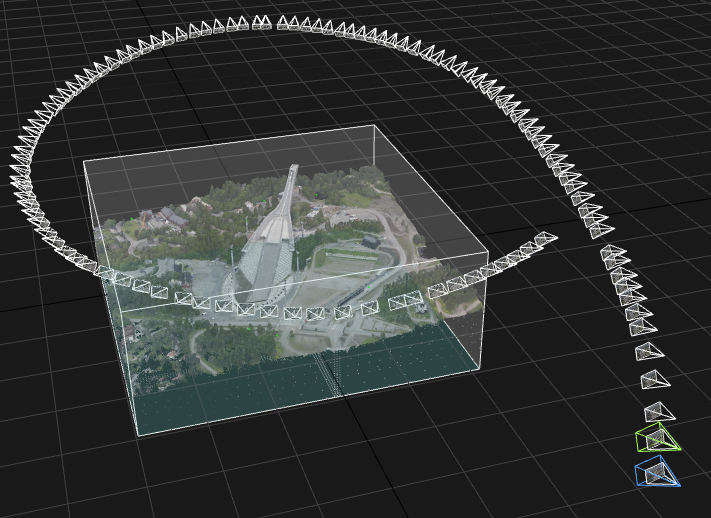

# Pose and camera geometry

Welcome to this lab in the computer vision course [TEK5030] at the University of Oslo.

In this lab we will experiment with poses in different coordinate frames together with the perspective camera model, using real data taken from a helicopter flying around Holmenkollen.

**Start** by cloning this repository on your machine. 

Then, open the project in PyCharm.
If you are uncertain about how this is done, please take a look at [the intro lab].

The lab is carried out by following these steps:

1. [Get an overview](lab-guide/1-get-an-overview.md)
2. [From geographical coordinates to pixels](lab-guide/2-from-geographical-coordinates-to-pixels.md)

Please start the lab by going to the [first step](lab-guide/1-get-an-overview.md).

[TEK5030]: https://www.uio.no/studier/emner/matnat/its/TEK5030/
[the intro lab]: https://github.com/tek5030/lab-intro/blob/master/py/lab-guide/1-open-project-in-pycharm.md
