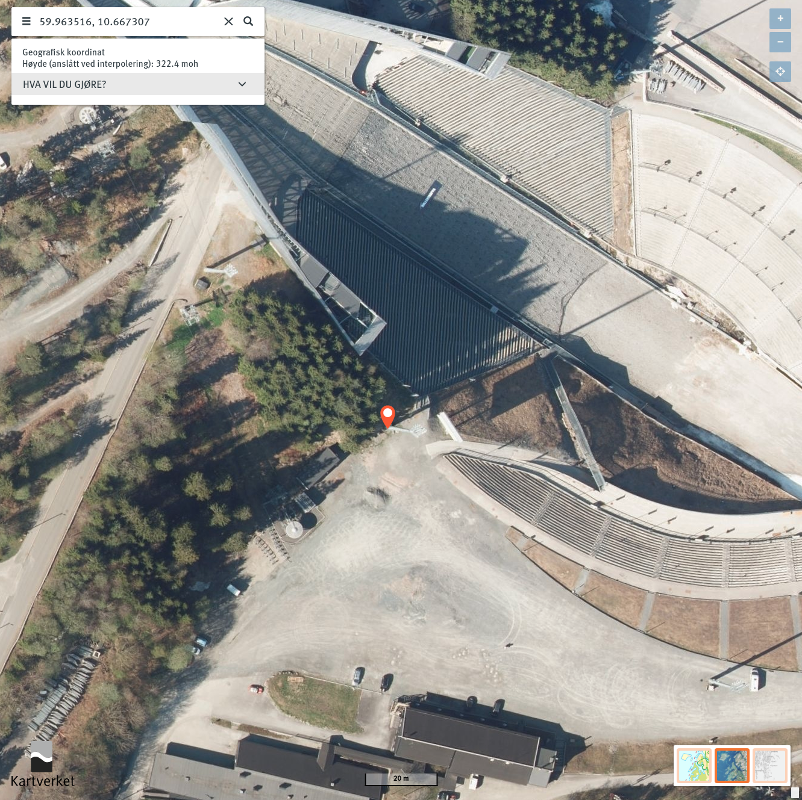
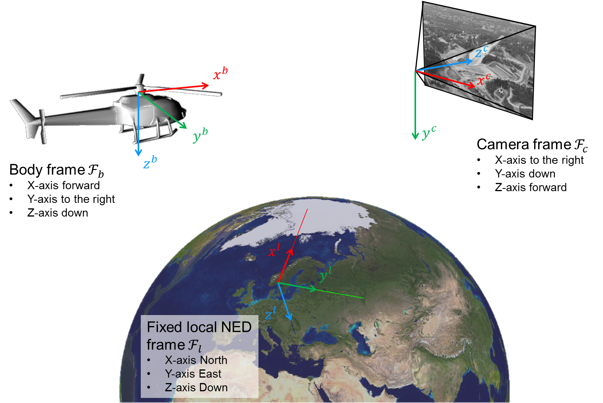
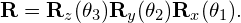
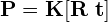

# Step 2: From geographical coordinates to pixels
Now, lets compute the connection between geographical coordinates and image pixels using real data!

## Representing orientations and poses in code
We will use Trym's [pylie](https://github.com/tussedrotten/pylie) to represent orientations and poses.
It lets us perform operations on SO(3) and SE(3) matrix Lie groups.

Here are some of the most useful operations available:

| Operation            | Function                              | Operator |
|----------------------|---------------------------------------|:--------:|
| Construction         | orientation = SO3(rotation_matrix)    |          |
|                      | pose = SE3( (orientation, position) ) |          |
| As matrix            | R = SO3.matrix                        |          |
|                      | T = SE3.to_matrix()                   |          |
| Inverse              | X_inv = X.inverse()                   |          |
| Composition          | XY = X.compose(Y)                     |  X @ Y   |
| Action               | X.action(x)                           |  X * x   |
| Manifold right plus  | X.oplus(v)                            |  X + v   |
| Manifold right minus | Y.ominus(X)                           |  Y - X   |

Take a look at [so3.py](https://github.com/tussedrotten/pylie/blob/master/pylie/so3.py) and [se3.py](https://github.com/tussedrotten/pylie/blob/master/pylie/se3.py) for documentation and the rest of the available operations. 
Ask the instructors when you have questions about pylie!

## Coordinate systems
In [lab_camera_pose.py](../lab_camera_pose.py) we are given the geodetic position of a light pole:

We will create a local Cartesian NED coordinate system around this position using `LocalCoordinateSystem`. 

The helicopter (body) navigation data is given as a set of corresponding:
  - [Geodetic positions](https://en.wikipedia.org/wiki/Geographic_coordinate_system)
  - [NED attitudes](https://en.wikipedia.org/wiki/Axes_conventions#Ground_reference_frames:_ENU_and_NED). 

The `LocalCoordinateSystem` class lets us convert this navigation data to poses in the local coordinate system *Fl*.
  - Take a look at `LocalCoordinateSystem` in [common_lab_utils.py](../common_lab_utils.py).

With `LocalCoordinateSystem`, we are able to represent the poses of the helicopter *Fb* in a common Cartesian coordinate system *Fl*.

The camera  pose measurements in *Fc* are represented as Cartesian positions with corresponding NED attitudes relative to the body frame *Fb*.

For each image, we are given these data in `DataElement`. 
  - Take a look at `DataElement` in [dataset.py](../dataset.py).
  - Then, get an overview of the data structures `Attitude`, `CartesianPosition`, `GeodeticPosition` and `Intrinsics` in [common_lab_utils.py](../common_lab_utils.py).

## 1. Convert geographical body position and attitude to local Cartesian pose
Get an overview of the lab main loop:
  - Take a quick look at the code in `run_camera_pose_lab()` in [lab_camera_pose.py](../lab_camera_pose.py).

The first step is to convert the navigation data to the poses **T***lb* (pose of *Fb* relative to *Fl*). 
To accomplish this, we need to convert the orientation from roll-pitch-yaw Euler angles (*&theta;1*, *&theta;2*, *&theta;3*) to a proper rotation matrix:

You will need to finish the `to_SO3()` in [lab_camera_pose.py](../lab_camera_pose.py), which is used to convert `Attitude` to a `SO3` orientation.
1. Convert attitude in Euler angles (roll-pitch-yaw) to an `SO3`. 
   Hint: Use the `rot_x()`, `rot_y()` and `rot_z()` methods in `SO3`.
2. Add body axes to the 3D viewer using [`Viewer3D.add_body_axes()`](../viewer_3d.py).
3. Run the lab. 
   You should see the body axes for each image.
   The forward axis (is that *x*, *y* or *z*?) should point approximately towards the next pose.
   Check also that the other directions (right and down) look reasonable

## 2. Compute the pose of the camera
The next step is to convert the camera pose measurements to poses **T***lc* (pose of *Fc* relative to *Fl*).

You will need to finish `to_vector()` to return a column vector representing the translation between *Fb* and *Fc*. 
You can then use this translation and the corresponding SO(3) orientation from the camera's attitude to compute the SE(3) pose **T***bc*. 
This will let you compute and visualize the pose **T***lc*.

1. Convert the Cartesian position to a translation vector between *Fb* and *Fc* by finishing `to_vector()` in [lab_camera_pose.py](../lab_camera_pose.py).
2. Construct the pose **T***bc* in the body coordinate system.
3. Compute the pose **T***lc* in the local coordinate system.
4. Add the camera axes to the 3D viewer using [`Viewer3D.add_camera_axes()`](../viewer_3d.py).
5. Run the lab.
   You should see the camera axes together with the body axes for each image.
   The optical axis (is that *x*, *y* or *z*?) should point approximately towards the origin of the local coordinate system, shown by the big axes in the center of the grid plane.
   Does the result look reasonable?

## 3. Undistort the images
The camera models are represented by the `PerspectiveCamera` class in [lab_camera_pose.py](../lab_camera_pose.py).
  - Take a look at this class.

Before we can project world points into the images, we need to undistort them.
  - Why?

The calibration parameters have been read into `Intrinsics` objects. 
To use them, we need to finish `PerspectiveCamera.from_intrinsics()`, which puts together the camera calibration matrix **K** and an [OpenCV distortion coefficient vector](https://docs.opencv.org/4.5.5/d9/d0c/group__calib3d.html) so that we can construct a `PerspectiveCamera`.
We can then undistort the image using `PerspectiveCamera.undistort_image()`.

1. Construct the calibration matrix from the `Intrinsics` object in `PerspectiveCamera.from_intrinsics()`.
2. Construct the distortion coefficient vector from the `Intrinsics` object in `PerspectiveCamera.from_intrinsics()`.
   You should return a vector on the form [*k*1, *k*2, 0, 0, *k*3], where *k**i* are the different radial distortion parameters.
3. Use the camera model to undistort the image in `run_camera_pose_lab()`.
4. Run the lab. 
   You will probably not notice any significant changes to the images, but if they still look reasonable, we are ready to continue!

## 4. Project a geographic world point into the images
We are now ready to project the position of the light pole into each image. 
Remember that the light pole is at the origin in the local coordinate system *Fl*.

First, we need to compute the camera projection matrix

in `PerspectiveCamera._compute_camera_projection_matrix()`. 

Make certain that you are using the "correct" pose when you extract **R** and **t** to compute the projection matrix.

We can then use the camera projection matrix to implement the perspective camera projection function in `PerspectiveCamera.project_world_point()`. 
Remember to use the homogenous representation.

1. Finish `PerspectiveCamera._compute_camera_projection_matrix()`.
2. Finish `PerspectiveCamera.project_world_point()`.
3. Add the camera frustum to the 3D viewer using [`Viewer3D.add_camera_frustum()`](../viewer_3d.py).
4. Run the lab. 
   Does the camera frustums look reasonable? 
   Is the light pole projected correctly into the images (The images are transparen)?
   
Congratulations! 
You have now established the connection between geographical coordinates and image pixels using the power of imaging geometry! 
Cool, right?

## Extra
- Alter `PerspectiveCamera.project_world_point()` so that you can project a matrix of column vectors of points, and project other geographical points into the images (see www.norgeskart.no).
- Create a virtual camera and project points into this camera.
